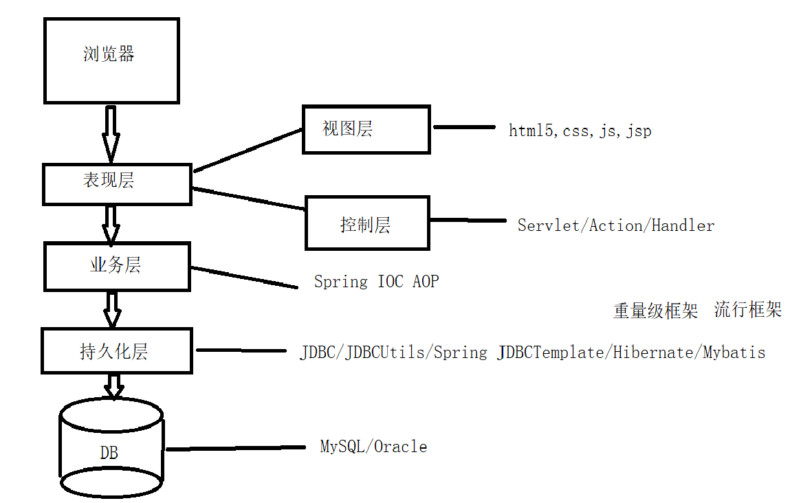

### Maven

<hr>

##### 1、为什么我们需要学习maven

（1）我们已经掌握的技术图：




（2）目前技术存在的问题：

+ 一个项目就是一个工程：如果一个项目非常庞大，不适合使用package划分模块，最好每一个模块对应一个工程，利于分工协作
+ 项目中jar包必须手动复制粘贴到lib文件夹下：同样的jar包文件重复出现在不同的项目工程中，有需要使用引用这个文件接口，并不需要把jar包复制过来
+ 一个jar包依赖的其它jar包需要下载，自己手动加入项目中（不同官网提供jar包五花八门）
+ 例子：commons-fileupload-1.3.jar依赖commons-io-2.0.1.jar，庞大的项目jar包的依赖关系也会很复杂


（3）Maven就是为了解决这些痛点，一个规范的jar包仓库，内容是可靠的


##### 2、Maven介绍

Maven是一款服务于Java平台的自动化构建工具（自动化构建工具发展：Make-> Ant -> Maven -> Gradle）


构建：以Java源文件，框架配置文件，JSP，HTML等资源为原材料，去生产一个可以运行的项目的过程

IDEA下构建Maven项目

使用一个标准的目录结构和一个默认的构建生命周期，使开发变得简单


构建环节：

> 1、清理：表示在编译代码前将之前的内容清除
>
> 2、编译：将源代码编译为字节码
>
> 3、测试：运行单元测试用例程序
>
> 4、报告：测试程序的结果
>
> 5、打包：将Java项目打成jar包
>
> 6、安装：将jar或war生成到maven仓库中
>
> 7、部署：将jar或war从maven仓库中部署到Web服务器上运行


maven基本理解：

maven本地仓库---远程仓库（私服）---中央仓库（maven团队维护管理）

pom.xml用于配置项目依赖（通过坐标找到唯一jar包）

没有jar包，先找本地仓库，没有找中央仓库下载


###### （1）maven核心概念

> 1、约定的目录结构
>
> + 工程名是根目录
> + src：存放源码
> + pom.xml：Maven核心配置文件
> + main目录：存放主程序
> + test目录：存放测试程序
> + Java目录：存放Java源文件
> + resource目录：存放框架或其它工具的配置文件
>
> 约定 > 配置 > 编码
>
> 2、常用maven命令
>
> 注意：执行与构建过程相关的maven命令必须进入`pom.xml`文件夹下
>
> ```java
> mvn clean:清理
> mvn compile:编译主程序
> mvn test-cmpile:编译测试程序
> mvn test:执行测试
> mvn package:打包
> ```


POM

项目对象模型（Project Object Model）

Maven的坐标：

使用下面3个向量在仓库中定位一个maven工程

（1）groupid：公司或组织域名倒序+项目名

（2）artifactid：特征，模块名

（3）version：版本


Maven工程的坐标与仓库路径的对应关系：

```xml
<groupid>org.springframework</groupid>
<artifactid>spring-core</artifactid>
<version>4.0.0.RELEASE</version>
```

仓库中位置：

目录结构按照这个关系坐标创建，文件名为artifactid+version，这样可以确保每一个包保存是唯一的

`org/springframework/spring-core/4.0.0.RELEASE/spring-core-4.0.0.RELEASE.jar`


仓库中保存的内容

+ Maven自身所需要的插件

+ 第三方框架或工具的jar包

+ 个人开发的Maven工程

依赖之间如何互相引用

使用`mvn install`


maven使用流程

> 1、下载maven压缩包
>
> Maven仓库地址：http://mavenrepository.com/
>
> Maven下载地址：http://maven.apache.org/download.cgi
>
> Maven下载：Apache官网
>
> 2、配置`MAVEN_HOME`环境变量
>
> 然后将变量拼接`/bin`加入到Path中
>
> 3、修改配置文件
>
> 配置文件：
>
> `conf/settings.xml`
>
> ```xml
> <!--配置本地仓库地址：maven不会自动创建本地仓库，需要自己创建一个仓库文件夹-->
> <localRepository>D:\LocalMavenLib</localRepository>
> 
> <!--镜像：阿里云-->
> <mirrors>
> 	<mirror>
> 　　   <id>alimaven</id>
> 　　   <mirrorOf>central</mirrorOf>
> 　　   <name>aliyun maven</name>
>       <url>http://maven.aliyun.com/nexus/content/groups/public/</url>
> 	</mirror>
> </mirrors>
> ```

