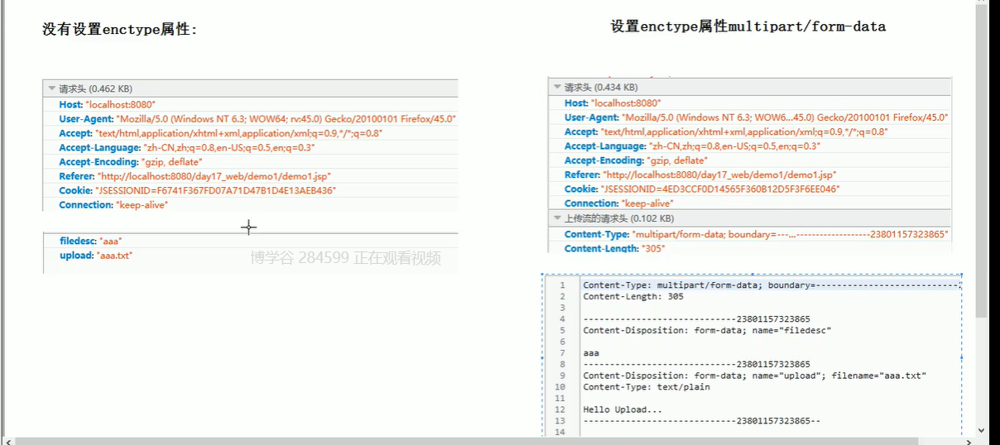

### 注解、动态代理、ClassLoader

<hr>

##### 1、注解

JDK中提供的注解

> 1、`@Override`代表是重写或接口实现方法，不允许出错
>
> JDK1.5版本：只能用在类的继承上
>
> JDK1.6版本：可以在类的集成上，也可以用在接口的实现上
>
> 2、`@SuppressWarning("all")`压制警告
>
> 3、`@Depracated`标记废弃，过时的注解，使用会出现中划线


自定义注解

```java
//定义自定义注解
public @interface MyAnno {
    //定义注解的属性
    String name();
    //定义有默认值的属性
    int age() default 10;
    //可以传class,enum,annotation
    Class c();
    Color color();
    Anno anno();
}

class Demo {}
enum Color{
    Red,Blue,Green;
}
@interface Anno{}
```


注解的属性的类型：

+ 基本数据类型
+ String类型
+ Class类型
+ 枚举类型
+ 注解类型


注解演示：

```java
public @interface MyAnno {
    String[] value;
}

class Demo {
    @MyAnno
    public void test (){
        System.out.println("test");
    }
    @MyAnno
    public void sayHello () {
        System.out.println("hello");
    }
}

class Test {
    public static void main (String[] args){
        Class clazz = Demo.class;
        Method[] methods = clazz.getMethods();
        for(Method m : methods){
            boolean flag = m.isAnnotationPresent(MyAnno.class);
            //全是false，因为元注解只存在源码阶段
            System.out.println(flag);
        }
    }
}
```


自定义注解存在的阶段

自定义注解存在于源代码阶段，生成的字节码文件，注解就没有了

A.java（注解默认存在于源码阶段）	-->	A.class	-->     JVM


元注解

```java
@Retention(Retention.RUNTIME)
//Retention是枚举类型，可以定义注解的存在阶段，分为SOURCE（源码阶段），CLASS（字节码阶段），RUNTIME（运行时阶段也能存在）
```

注解是给虚拟机识别的，代码注释是给程序员看的


##### 2、使用Servlet3.0于注解完成文件上传功能

Servlet3.0支持注解

分析：

文件上传技术有哪些？

Servlet3.0：支持注解开发，文件上传，异步请求（不如Ajax）

JSPSmartUpload：嵌入到JSP完成文件上传（比较老）

FileUpload：Apache的文件上传组件

Struts2：对FileUpload又进行了封装


###### （1）文件上传的三个要素(以上技术都要满足这个条件)：

1、表单提交方式必须是post请求（因为get请求有大小限制）

2、需要有文件上传的表单元素，且必须有`name`属性：`<input type="file" name="upload">`

3、表单的`enctype`属性必须是`multipart/form-data`，这个属性是上传流的请求头


`enctype`属性设置于不设置的区别：




文件上传原理：

我们可以从请求头的boundary进行分割，可以获得数据的分割线

切分数据分为：文件描述和文件流


###### （2）使用Servlet3.0实现文件上传

不用创建xml了，使用注解开发（开发快，但是没有使用配置文件形式易于维护）


upload file demo：

```java
@WebServlet("/upload")
//需要加注解,否则很多文件上传的方法无法使用
@MultipartConfig
public class UploadFileServlet extends HttpServlet {
    public void doPost (req,res){
        //设置编码
        req.setCharacterEncoding("UTF-8");
        String desc = req.getParameter("file_desc");
        //接收文件
        Part part = request.getPart("upload");
        //获得文件大小
        long size = part.getSize();
        System.out.println(size);
        //获取文件夹的绝对路径
        String path = this.getServletContext().getRealPath("/upload");
        System.out.println("path:" + path);
        //获取文件名
        String filename = part.getSubmittedFileName();
        System.out.println("filename:"+filename);
        //获取输入输出流
        InputStream is = req.getInputStream();
        OutputStream os = new FileOutputStream(path + "/" + filename);
        byte[] b = new byte[1024];
        int count = is.read(b);
        while(count != -1){
            os.write(b);
            count = is.read(b);
        }
        is.close();
        os.close();
    }
}
```

form.jsp：

```jsp
<%@ page contentType="text/html;charset=UTF-8" language="java" %>
<html>
<head>
  <title>Title</title>
</head>
<body>
<form action="/uploadDemo/upload" enctype="multipart/form-data" method="post">
  FileDescription:<input type="text" name="file_desc"><br>
  FileUpload:<input type="file" name="upload"><br>
  <input type="submit" value="上传">
</form>
</body>
</html>

```


###### （3）解决文件上传文件重名的问题

```java
public class UUIDUtils {
    public static String getUUID {
        //获取的随机字符序列：192f0b25-d2d2-4945-9697-67edc0ee6a1f
        return UUID.randomUUID().toString().replace("-","");
    }
    
    public static String getUUIDFilename (String filename){
        return UUID.randomUUID().toString().replace("-","")+"_"+filaname;
    }
}
```


###### （4）目录下存放文件过多

导致以后之后的用户读写操作很慢


目录分离：

+ 按时间分：
+ 按数量分：一个目录下存指定数量的文件，超过就创建一个新的文件夹
+ 按用户分：为每个用户创建一个单独目录存放文件
+ 按目录分离算法分：
  - 使用唯一文件名的`hashcode`值，int类型
  - `hashcode`与`0xf`15（1111）进行与运算获得的值，作为一级目录
  - `hashcode`右移4位，得到的值作为二级目录
  - 共得到八级目录，每一个有16个子目录，42亿多个目录
  - 设计自己的算法：比如8个子目录，分四级，`hashcode&111`，会得到八个不一样的一级目录，不断右移8位得到4级目录


目录分离利用算法创建文件夹

```java
@WebServlet("/upload")
@MultiConfig
public class UploadServelt extends HttpServlet {
    public void doPost (req,resp){
        //获取part
        Part part = req.getPart("upload");
        //获取文件名
        String filename = part.getSubmittedFileName();
        //获取UUID的随机文件名
        String uuid_filename = UUIDUtils.getUUIDFileName(filename);
        //获取当前文件的绝对路径
        String dirRealPath = this.getServletContext().getRealPath("/upload");
        //获取算法路径
        String relativePath = UUIDUtils.getRelativePath(uuid_filename);
        //绝对路径
        String absolutePath = dirRealPath + relativePath;
        File file = new File(absolutePath);
        //文件不存在创建文件夹
        if(!file.exists()){
            file.mkdirs();
        }
        //获得输入、输出流
        InputStream is = part.getInputStream();
        OutputStream os = new FileOutputStream(absolutePath);
        ...读写操作
    }
}

class UUIDUtils {
    public static getUUIDFileName (String filename){
        return UUID.randomUUID().toString().replace("-","")+"_"+filename;
    }
    public static getRelativePath (String filename){
        //四级目录，每一级8个子目录
        int code = filename.hashCode();
        int grade = 8;
        //获取一级目录
        int d1 = code & 7;
        //获取二级目录
        int code2 = code >>> 8;
        int d2 = code2 & 7;
        //获取三级目录
        int code3 = code2 >>> 8;
        int d3 = code3 & 7;
        //获取四级目录
        int code4 = code3 >>> 8;
        int d4 = code4 & 7;
        StringBuilder sb = new StringBuilder();
        sb.append("/");
        sb.append(""+d1);
        sb.append("/");
        sb.append(""+d2);
        sb.append("/");
        sb.append(""+d3);
        sb.append("/");
        sb.append(""+d4);
        return sb.toString();
    }
}
```

`form.jsp`

```jsp
<%@ page contentType="text/html;charset=UTF-8" language="java" %>
<html>
<head>
  <title>Title</title>
</head>
<body>
<!--使用pageContext.servletContext.contextPath等同于项目名，便于维护-->
<form action="${pageContext.servletContext.contextPath}/upload" enctype="multipart/form-data" method="post">
  FileDescription:<input type="text" name="file_desc"><br>
  FileUpload:<input type="file" name="upload"><br>
  <input type="submit" value="上传">
</form>
</body>
</html>
```


Servlet3.0	demo：

```java
  /*
   *配置初始化参数
   *urlPatterns 请求路径
   *loadOnStartUp 启动加载
   *initParams配置初始化参数
   *传入@WebInitParam(key,value)，可以传多个
   *
   *@WebListener监听器
   *@WebFilter(urlPatterns="/*")过滤器
   */
    @Webservlet(urlPatterns="/ServletDemo1",loadOnStartUp=2,initParams={@WebInitParam(name="username",value="chen"),@...)})
public class LoginServlet extends HttpServlet {
    public void doGet (...,...){
        System.out.println("Servlet 3.0");
    }
    
    public void doPost (...,...){
        doGet(req,resp);
    }
}
```


##### 3、动态代理

需求：无论使用Get还是Post请求，只需要调用`request.getParameter()`方法就可以了


###### （1）技术分析

增强request中的方法方式：

+ 继承
+ 装饰者模式：缺点，重写方法太多
+ <font color="blue">动态代理模式：被增强的类实现了接口</font>


代理的概述

代理原理：


JDK中动态代理：Proxy对象

> 方法：
>
> `Proxy.newInstance(ClassLoader loader,Class<?>[] interfaces,InvocationHandler handler)`


###### （2）动态代理使用

```java
public interface Waiter {
    void serve();
}

class Waitress implements Waiter {
    public void serve () {
        System.out.println("provide service to client");
    }
}

class ProxyDemo {
    public void enhenceServe () {
        Waiter waiter = new Waitress();
        waiter.serve();
        //获得类加载器
        ClassLoader classLoader = ProxyDemo.class.getClassLoader();
        //获取接口
        Class[] interfaces = Waitress.class.getInterfaces();
        //获得一个实现InvocationHandler接口的类来干活
        Waiter waiter2 = Proxy.newProxyInstance(classLoader,interfaces,new MyInvocationHandler());
        //我们调用目标方法中的任何方法，都会调用invoke方法
        waiter2.serve();
    }
}

class MyInvocationHandler implements InvocationHandler {
    private Waiter waiter;
    
    public MyInvocationHandler (Waiter waiter) {
        this.waiter = waiter;
    }
    
    /*
    *增强serve方法,这样使用太不灵活了
    *所以用到参数了
    *proxy：产生的代理对象
    *method：当前正在调用的目标类的方法
    *params：当前执行方法中的参数
    */
    public Object invoke (Object proxy,Method method,Object[] params) {
        System.out.println("smile to client.");
        waiter.serve();
        
        //增强被调用的方法，所有方法都能增强
        //method.getName()来判断，进行指定增强
        System.out.println("smile to client.");
        Object obj = method.invoke(waiter,params);
        return obj;
    }
}
```


###### （3）动态代理报错

Exception in thread "main" java.lang.ClassCastException: domain.$Proxy0 cannot be cast to ...

<font color="blue">Java代理不可以对类进行代理，只能针对接口代理。</font>


###### （4）使用代理实现一个自动转化编码格式的过滤器

```java
@WebFilter("/*")
public class GenericEncodingFilter implements Filter {
    //...省略init,destroy方法;
    @Override
    public void doFilter(ServletRequest request, ServletResponse res, FilterChain filterChain) throws IOException, ServletException {
        //这样造型才能使用到request的所有方法
        final HttpServletRequest req = (HttpServletRequest)request;
        //动态代理实现getParameter方法的增强
        HttpServletRequest myReq = (HttpServletRequest) Proxy.newProxyInstance(req.class.getClassLoader(),req.getInterfaces(),new InvocationHandler() {
            public Object invoke (Object proxy,Method method,Object[] params) {
                //判断是否是getParameter方法
        		if("getParameter".equals(method.getName())){
                    String type = req.getMethod();//返回请求的方式
                    if("post".equalsIgnoreCase(type)){
                        req.setCharacterEncoding = "UTF-8";
                    }else if("get".equalsIgnoreCase(type)){
                        //对字符集进行转化
                        //针对Tomcat8以前的版本，使用ISO-8859-1编码格式
                        String value = (String)method.invoke(req,params);
                        value = new String(value.getBytes("ISO-8859-1"),"UTF-8");
                        return value;
                    }
                }
                return method.invoke(req,params);
    		}
        });
        //放行
        filterChain(myReq,res);
    }
}
```


动态代理企业应用

Spring两大核心：IOC控制反转（反射）和AOP（面向切面编程）


Spring的AOP：面向切面编程，解决OOP中遇到的一些问题


AOP的好处，多个实现同一个接口的类需要增强相同的方法，就可以用到动态代理


##### 4、类加载器

类加载器：ClassLoader


Java中将类加载器分为3类：

+ 引导类加载器： Bootstrap Class Loader，用来加载Java运行的API（`/jre/lib/rt.jat`）
+ 扩展类加载器：Extension Class Loader用来加载`/jre/lib/ext/*.java`的类
+ 应用类加载器：App Class Loader(SystemClassLoader)加载程序员的自定义类


这些类加载器如何保证只会加载一次而且不会重复加载

类加载器的全盘委托机制

 ```java
class A {
    String name = "chen";
}
//App Class Loader 得到A.class和String.class,向上委托
//交给Extension Class Loader,向上委托
//交给Bootstrap Class Loader,加载String.class,没有A.class
//向下交给Extension Class Loader
//向下交给App Class Loader，找到A.class

//引导类加载器是虚拟机的一部分，是c++编写的，无法在查看了
public class MyClassLoader {
    public void demo {
        //应用类加载器
        ClassLoader loader = User.class.getClassLoader();
        System.out.println(loader);
        //扩展类加载器，DNSNameService是扩展里的类
        ClassLoader ex_loader = DNSNameService.class.getClassLoader();
        System.out.println(ex_loader);
    }
}
 ```


Tomcat对类加载器进行了扩展，增加了一个加载Tomcat自身的lib文件夹下的类，一个是加载WEB-INF下的lib文件夹下的类